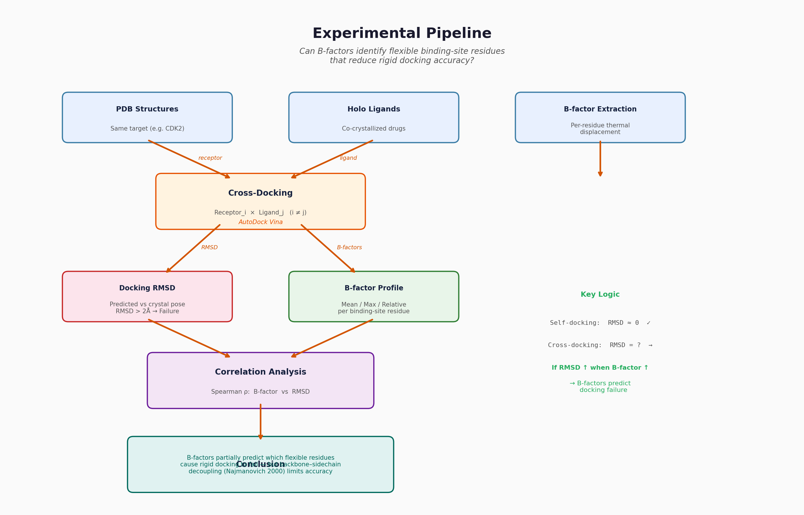

# BFIbs-Ensemble — B-factor Guided Ensemble Docking

**Can crystallographic B-factors predict docking difficulty — and guide ensemble
selection better than random chance?**

BFIbs-Ensemble tests this hypothesis end-to-end: survey a protein target in the
PDB → extract per-residue B-factors at the binding site → cross-dock with
AutoDock Vina → compare B-factor-guided ensemble selection (BFIbs; Halip et al.,
2021) against random and lowest-B-factor baselines. The Ensemble Optimizer
(EnOpt; Bhatt et al., 2024) provides the literature upper bound for ensemble
docking performance (see [Relation to EnOpt](#relation-to-enopt)).



---

## Quick Start

```bash
cd experiment

# 1. Find structures for your target (auto-updates config.py)
python main.py survey CDK2

# 2. Download them
python main.py download

# 3. Run the full pipeline (includes EnOpt ML benchmark)
python main.py all
```

Results appear in `experiment/output/` (CSVs) and `experiment/figures/` (plots).

---

## Setup

### 1. Python environment

```bash
pip install biopython numpy scipy matplotlib
```

| Package | Used for |
|---------|----------|
| `biopython` | PDB parsing, structure I/O, ligand identification |
| `numpy` | B-factor statistics, RMSD computation, array operations |
| `scipy` | Pearson/Spearman correlation, t-tests |
| `matplotlib` | Scatter plots, histograms, bar charts |
| `pandas` | Data manipulation, EnOpt matrix export |
| `scikit-learn` | EnOpt Random Forest backend |
| `xgboost` | EnOpt XGBoost backend |
| `plotly` | EnOpt interactive output |

### 2. External tools

#### AutoDock Vina

Vina **cannot** be installed via `pip` or `brew`. Download the pre-compiled
binary for your platform:

**macOS (Apple Silicon / aarch64):**
```bash
curl -sL "https://github.com/ccsb-scripps/AutoDock-Vina/releases/download/v1.2.7/vina_1.2.7_mac_aarch64" \
  -o experiment/vina
chmod +x experiment/vina
experiment/vina --version   # verify
```

**macOS (Intel / x86_64):**
```bash
curl -sL "https://github.com/ccsb-scripps/AutoDock-Vina/releases/download/v1.2.7/vina_1.2.7_mac_x86_64" \
  -o experiment/vina
chmod +x experiment/vina
```

**Linux:**
```bash
curl -sL "https://github.com/ccsb-scripps/AutoDock-Vina/releases/download/v1.2.7/vina_1.2.7_linux_x86_64" \
  -o experiment/vina
chmod +x experiment/vina
```

`config.py` auto-detects the binary at `experiment/vina`. If you prefer a
system-wide install, move the binary to a directory on `PATH` (e.g.
`/usr/local/bin/vina`) and update `VINA_BINARY` in `config.py` accordingly.

> Latest releases: [github.com/ccsb-scripps/AutoDock-Vina/releases](https://github.com/ccsb-scripps/AutoDock-Vina/releases)

#### Open Babel

| Tool | Version tested | Install |
|------|---------------|---------|
| **Open Babel** | ≥ 3.1 | `brew install open-babel` (macOS) or [openbabel.org](https://openbabel.org/) |

Verify:
```bash
obabel --version
```

### 3. (Optional) MGLTools fallback

If Open Babel PDB → PDBQT conversion fails, the pipeline falls back to
MGLTools scripts (`prepare_receptor4.py`, `prepare_ligand4.py`). Install from
[ccsb.scripps.edu/mgltools](https://ccsb.scripps.edu/mgltools/).

---

## Usage

All commands are invoked from the `experiment/` directory via `main.py`:

```
python main.py <command> [args]
```

### Command Reference

| Command | Argument | Description |
|---------|----------|-------------|
| `survey` | `<target_name>` | Search the PDB for all X-ray structures of a protein target |
| `download` | — | Download PDB files listed in `config.TARGET_PDB_IDS` |
| `bfactors` | — | Extract per-residue B-factors for binding-site residues |
| `prepare` | — | Convert PDB → PDBQT (receptor + ligand) for Vina docking |
| `dock` | — | Run all-vs-all rigid cross-docking with AutoDock Vina |
| `analyze` | — | Correlation analysis (B-factor vs RMSD) + statistical tests + figures |
| `ensemble` | — | Calculate BFIbs, select ensembles, compare strategies (incl. EnOpt) |
| `enopt` | — | Run EnOpt ML-based ensemble selection benchmark |
| `all` | — | Run `bfactors → prepare → dock → analyze → ensemble → enopt` in sequence |

### Step-by-step walkthrough

#### `survey <target_name>` — Find structures

Queries the [RCSB PDB Search API](https://search.rcsb.org) for all structures
matching the target name. Filters to X-ray crystallography with resolution
≤ 3.0 Å. Prints a table sorted by resolution and a ready-to-paste
`TARGET_PDB_IDS` list.

**What name to use?** Anything the PDB knows — gene names (`CDK2`, `EGFR`,
`MAPK14`), common names (`Thrombin`, `Trypsin`), or multi-word names in quotes
(`"carbonic anhydrase II"`, `"HIV-1 protease"`). The survey uses RCSB's
full-text search, so if the protein is in the PDB, it'll find it.

**Example output:**

```
$ python main.py survey CDK2
============================================================
Surveying PDB for: CDK2
============================================================
Found 148 total entries
After filtering (X-ray, ≤3.0Å): 49 structures

PDB ID     Resolution   Title
----------------------------------------------------------------------
1AQ1       1.80 Å       CYCLIN-DEPENDENT KINASE 2 (CDK2)...
1B38       1.90 Å       HUMAN CYCLIN-DEPENDENT KINASE 2...
...
# Add these to config.py TARGET_PDB_IDS:
TARGET_PDB_IDS = ["1AQ1", "1B38", ...]
```

The survey **automatically updates** `TARGET_PDB_IDS` in `config.py` with the
best-resolution structures. No manual copy needed.

#### `download` — Fetch PDB files

Downloads `.pdb` files from [files.rcsb.org](https://files.rcsb.org) for every
ID in `config.TARGET_PDB_IDS`. Skips files already cached in `data/pdb_files/`.

#### `bfactors` — Extract binding-site B-factors

For each downloaded structure:

1. **Identify the co-crystallized ligand** — largest non-standard, non-solvent
   residue with ≥ 5 heavy atoms.
2. **Find binding-site residues** — all protein residues with any atom within
   `BINDING_SITE_DISTANCE` Å (default 5.0) of the ligand.
3. **Extract per-residue B-factors** — average of all atoms + Cα only.
4. **Compute relative B-factor** — \( B_{\text{relative}} = B_{\text{residue}} / B_{\text{pocket average}} \).

| Output file | Content |
|-------------|---------|
| `output/bfactor_summary.csv` | Per-residue: `pdb_id`, `chain`, `resseq`, `resname`, `avg_bfactor`, `relative_bfactor`, `ca_bfactor` |
| `output/bfactor_per_structure.csv` | Per-structure: `pdb_id`, `ligand`, `pocket_avg_bfactor`, `pocket_std_bfactor`, `n_binding_site_residues` |

#### `prepare` — Generate Vina inputs

For each structure in `data/pdb_files/`:

1. Strip non-protein atoms → clean receptor PDB.
2. Extract ligand HETATM records → ligand PDB.
3. Convert both to PDBQT format using Open Babel (`obabel`), with MGLTools
   fallback.

| Output directory | Content |
|-----------------|---------|
| `data/vina_inputs/` | `{pdb_id}_receptor.pdbqt`, `{pdb_id}_ligand.pdbqt` |

#### `dock` — Cross-docking

For every pair (receptor *i*, ligand *j*, *i* ≠ *j*):

1. Define search box centered on the co-crystallized ligand position.
2. Run `vina` with `exhaustiveness=64`, `num_modes=9`.
3. Compute heavy-atom RMSD between the best docked pose and the crystal pose.

| Output file | Content |
|-------------|---------|
| `output/cross_docking_results.csv` | `receptor`, `ligand_from`, `rmsd`, `affinity`, `status` |

> **Runtime:** O(N²). With 12 structures, ~132 pairs × ~60s ≈ 2.2 hours at
> exhaustiveness=64 on a modern laptop.

#### `analyze` — Statistical analysis

Merges B-factor data with cross-docking results:

- **Pearson & Spearman** correlation: pocket avg/max/std B-factor vs RMSD.
- **t-test**: B-factor distribution of successful (RMSD < 2 Å) vs failed pairs.
- **Figures:** scatter (B-factor vs RMSD), histogram (success vs failure), RMSD distribution.

| Output file | Content |
|-------------|---------|
| `output/analysis_summary.csv` | Per-pair metrics with high-B-factor residues |
| `output/statistical_tests.txt` | Pearson/Spearman r, p-values, t-test |
| `figures/bfactor_vs_rmsd.png` | Scatter plot with linear fit |
| `figures/bfactor_distribution.png` | Histogram: success vs failure B-factor distributions |
| `figures/rmsd_distribution.png` | Overall RMSD distribution |

#### `ensemble` — Ensemble docking comparison

1. **Compute BFIbs** — \( \text{BFIbs} = \text{median}(B_{\text{pocket}}) / \text{median}(B_{\text{protein}}) \) for each structure (Halip et al., 2021).
   - BFIbs < 1: binding site more rigid than protein average.
   - BFIbs ≈ 1: balanced flexibility (preferred).
   - BFIbs > 1: binding site more flexible than average.
2. **Select ensembles** using four strategies at sizes *n* = {2, 3, 5}:
   - `bfactor_guided` — structures with BFIbs closest to 1.0.
   - `random` — 20 random draws for statistical comparison.
   - `lowest_bfactor` — most rigid binding sites.
   - `enopt` — ML-based selection via EnOpt (Bhatt et al., 2024).
3. **Evaluate ensembles** — for each ligand, dock against all ensemble members
   and take the best pose (lowest RMSD).
4. **Compare strategies** — success rates with standard deviations.

| Output file | Content |
|-------------|---------|
| `output/bfibs_scores.csv` | BFIbs + pocket/protein B-factor medians per structure |
| `output/ensemble_selections.csv` | Which PDB IDs in each ensemble, with BFIbs values |
| `output/ensemble_docking_results.csv` | Per-ensemble success rates and RMSD statistics |
| `output/ensemble_comparison.csv` | Strategy × size comparison summary |
| `output/enopt_ensemble.csv` | EnOpt-selected ensemble members per size |
| `figures/ensemble_comparison.png` | Grouped bar chart with error bars (4 strategies) |

#### `enopt` — ML-based ensemble selection

Runs EnOpt (Bhatt et al., 2024) as an ML benchmark:

1. **Export score matrix** — converts `cross_docking_results.csv` to EnOpt's
   compounds × conformations CSV format (affinity scores).
2. **Create known ligands** — randomly selects 50% of co-crystallized ligands
   as "known actives" for supervised ML training.
3. **Run EnOpt** — Random Forest/XGBoost identifies the most predictive
   receptor conformations via 3-fold CV.
4. **Parse ensemble** — ranks conformations by cross-model votes, saves
   selections to `output/enopt_ensemble.csv`.

After running `enopt`, re-run `ensemble` — the EnOpt-selected ensemble is
automatically included in the strategy comparison.

> **Dependencies:** `pip install pandas scikit-learn xgboost plotly`

---

## Configuration Reference

All parameters live in [`experiment/config.py`](experiment/config.py):

| Parameter | Default | Description |
|-----------|---------|-------------|
| `TARGET_PDB_IDS` | `[]` | List of PDB IDs to download and analyze |
| `BINDING_SITE_DISTANCE` | `5.0` | Å — max distance from ligand atom to pocket residue |
| `VINA_BINARY` | `os.path.join(BASE_DIR, "vina")` | Path to Vina executable (auto-detected in `experiment/`) |
| `VINA_BOX_SIZE` | `(25, 25, 25)` | ų — docking search box dimensions |
| `VINA_EXHAUSTIVENESS` | `64` | Higher = more thorough conformational search, slower |
| `VINA_NUM_MODES` | `9` | Number of binding poses Vina generates |
| `RMSD_SUCCESS_THRESHOLD` | `2.0` | Å — docked pose with RMSD below this = "success" |
| `BFACTOR_HIGH_PERCENTILE` | `75` | Percentile cutoff for "high B-factor" residues |
| `ENSEMBLE_SIZES` | `[2, 3, 5]` | Ensemble sizes to test |
| `ENSEMBLE_STRATEGIES` | `["bfactor_guided", "random", "lowest_bfactor"]` | Selection strategies |
| `NUM_RANDOM_ENSEMBLES` | `20` | Random draws for statistical comparison |
| `FIGURE_DPI` | `150` | Output figure resolution |
| `FIGURE_STYLE` | `"seaborn-v0_8-whitegrid"` | Matplotlib style |

---

## Pipeline Architecture

```
survey ──→ download ──→ bfactors ──→ prepare ──→ dock ──→ analyze
                                                    │         │
                                                    └──→ ensemble ──→ compare
                                                          │
                                                          └──→ enopt (ML benchmark)
```

| Step | Script | Core functions |
|------|--------|---------------|
| Survey + Download | `step1_download_structures.py` | `search_pdb()`, `get_structure_info()`, `download_pdb()` |
| B-factor extraction | `step2_extract_bfactors.py` | `identify_ligand()`, `extract_bfactors()`, `compute_relative_bfactors()` |
| Cross-docking | `step3_cross_docking.py` | `prepare_receptor_pdb()`, `prepare_ligand_pdb()`, `pdb_to_pdbqt()`, `run_vina()`, `compute_rmsd()` |
| Analysis | `step4_analyze.py` | `analyze()` — correlation tests, t-test, figure generation |
| Ensemble docking | `step5_ensemble_docking.py` | `calculate_bfibs()`, `select_ensemble_bfactor_guided()`, `run_ensemble_docking()`, `compare_strategies()` |
| EnOpt benchmark | `step6_enopt.py` | `export_enopt_matrix()`, `run_enopt()`, `parse_enopt_ensemble()` |

The orchestrator [`experiment/main.py`](experiment/main.py) ties everything
together with a CLI that wraps each module's entry point.

---

## Relation to EnOpt

[EnOpt](https://github.com/durrantlab/EnOpt) (Bhatt et al., 2024) is a
machine-learning-based ensemble optimizer that takes a pre-computed docking
score matrix (compounds × conformations) and uses random forest or XGBoost
models to identify the most predictive sub-ensemble and a weighted consensus
score. It answers: *given docking scores, which ensemble members are most
useful?*

BFIbs-Ensemble now **integrates EnOpt as a benchmark strategy** (`step6_enopt.py`).
The pipeline exports its cross-docking affinity matrix in EnOpt format, runs
EnOpt to select ensembles via ML, then compares the result against BFIbs-guided,
random, and lowest-B-factor strategies using the same evaluation metric (success
rate = RMSD < 2 Å).

```
BFIbs-Ensemble                         EnOpt (integrated)
─────────────────                      ─────────────────
B-factors → BFIbs → select             Docking scores → ML → weighted
ensemble members                       consensus score
         ╲                                      ╱
          ────── same evaluation ───────────────
                  (success rate comparison)
```

This lets us answer: *can simple crystallographic B-factors match or complement
machine learning for ensemble curation?*

**Key differences from EnOpt:**

| Aspect | EnOpt (Bhatt et al., 2024) | BFIbs-Ensemble |
|--------|---------------------------|----------------|
| Input | Docking score matrix (compounds × conformations) | PDB structures + B-factors |
| Method | Random Forest / XGBoost | BFIbs index (Halip et al., 2021) |
| Output | Weighted consensus score, best sub-ensemble | Ensemble success rate comparison |
| Requires docking first? | Yes | Yes (cross-docking for evaluation) |
| Interpretability | Feature importance from trees | Directly interpretable (B-factor = atomic displacement) |

---

## Repository Layout

```
.
├── README.md                                   # This file
├── .gitignore
├── Checkpoint_1.md                             # Topic intro + key references
├── Checkpoint_2.md                             # Code check-in progress report
├── Literature_Review_B-factors_and_Docking.md  # Annotated literature review (18 refs)
├── Paper_Outline_B-factors_and_Docking.md      # Paper outline with thesis statement
├── Project_Plan.md                             # Project plan with timeline
├── experiment/
│   ├── config.py                               # All tunable parameters
│   ├── main.py                                 # CLI orchestrator (survey → ensemble)
│   ├── pipeline_diagram.png                    # Visual overview
│   ├── step1_download_structures.py            # PDB survey + download
│   ├── step2_extract_bfactors.py               # Per-residue B-factor extraction
│   ├── step3_cross_docking.py                  # Vina cross-docking + RMSD
│   ├── step4_analyze.py                        # Correlation + figures
│   ├── step5_ensemble_docking.py               # BFIbs + ensemble comparison
│   ├── step6_enopt.py                           # EnOpt ML benchmark integration
│   ├── enopt/                                   # EnOpt source (cloned from durrantlab/EnOpt)
│   ├── data/pdb_files/                         # Downloaded .pdb (gitignored)
│   ├── data/vina_inputs/                       # PDBQT files (gitignored)
│   ├── data/docking_results/                   # Vina output (gitignored)
│   ├── output/                                 # All CSVs (gitignored)
│   └── figures/                                # All plots (gitignored)
```

Runtime data (`data/`, `output/`, `figures/`) is regenerated by the pipeline
and excluded from version control via `.gitignore`.

---

## Troubleshooting

### "Vina not found"

Make sure the binary is downloaded to `experiment/vina`:
```bash
# macOS Apple Silicon (aarch64)
curl -sL "https://github.com/ccsb-scripps/AutoDock-Vina/releases/download/v1.2.7/vina_1.2.7_mac_aarch64" \
  -o experiment/vina
chmod +x experiment/vina
```
Or set the full path in `config.py`:
```python
VINA_BINARY = "/usr/local/bin/vina"
```

### "obabel: command not found"
Install Open Babel:
- **macOS:** `brew install open-babel`
- **Ubuntu/Debian:** `sudo apt install openbabel`
- Or use MGLTools as fallback (see [Setup](#3-optional-mgltools-fallback)).

### "No PDB files found in data/pdb_files/"
Run `python main.py download` first. Make sure `TARGET_PDB_IDS` in `config.py`
is populated (use `python main.py survey <target>` to generate the list).

### PDBQT conversion fails for some structures
Some PDB files have non-standard formatting. The pipeline will skip them and
continue. Check `data/vina_inputs/` to verify which structures were converted.

### Cross-docking takes too long
Reduce `VINA_EXHAUSTIVENESS` in `config.py` (e.g., from 64 to 16) for faster
but less thorough docking. Reduce the number of structures in
`TARGET_PDB_IDS`.

### "EnOpt not found"

EnOpt should be cloned into `experiment/enopt/`. If missing:
```bash
cd experiment
git clone --depth 1 https://github.com/durrantlab/EnOpt.git enopt
```
Also install EnOpt dependencies:
```bash
pip install pandas scikit-learn xgboost plotly
```

### EnOpt fails with import errors
Make sure you're running from the `experiment/` directory (not `enopt/`).
The pipeline sets `PYTHONPATH` correctly when invoked via `main.py enopt`.

---

## References

1. **Halip, L., Avram, S., & Neanu, C. (2021).** The B-factor index for the binding site (BFIbs) to prioritize crystal protein structures for docking. *Structural Chemistry*, 32(4), 1693–1699. [doi:10.1007/s11224-021-01755-5](https://doi.org/10.1007/s11224-021-01755-5)
2. **Bhatt, R., Wang, A., & Durrant, J. D. (2024).** Teaching old docks new tricks with machine learning enhanced ensemble docking. *Scientific Reports*, 14, 22489. [doi:10.1038/s41598-024-71699-3](https://doi.org/10.1038/s41598-024-71699-3)
3. **De Paris, R., Vahl Quevedo, C., Ruiz, D. D., Gargano, F., & de Souza, O. N. (2018).** A selective method for optimizing ensemble docking-based experiments on an InhA fully-flexible receptor model. *BMC Bioinformatics*, 19, 235. [doi:10.1186/s12859-018-2228-9](https://doi.org/10.1186/s12859-018-2228-9)
4. **Bolstad, A. C., & Anderson, A. C. (2009).** In pursuit of virtual lead optimization: Pruning ensembles of receptor structures for increased efficiency and accuracy during docking. *Journal of Computer-Aided Molecular Design*, 23(11), 755–763. [doi:10.1007/s10822-009-9220-9](https://doi.org/10.1007/s10822-009-9220-9)
5. **Amaro, R. E., Baudry, J., Chodera, J., Demir, Ö., McCammon, J. A., Miao, Y., & Smith, J. C. (2018).** Ensemble docking in drug discovery. *Biophysical Journal*, 114(10), 2271–2278. [doi:10.1016/j.bpj.2018.02.038](https://doi.org/10.1016/j.bpj.2018.02.038)
6. **Korb, O., Olsson, T. S. G., Bowden, S. J., Hall, R. J., Verdonk, M. L., Liebeschuetz, J. W., & Cole, J. C. (2012).** Potential and limitations of ensemble docking. *Journal of Chemical Information and Modeling*, 52(5), 1292–1304. [doi:10.1021/ci300064d](https://doi.org/10.1021/ci300064d)

---

## Contributors

| Name | Role |
|------|------|
| Lucas | Pipeline architecture, cross-docking (step3), ensemble docking (step5) |
| James | PDB survey (step1), B-factor extraction (step2), analysis (step4) |
| Lola | Literature review, paper outline, reference formatting |
| Emily | Test data preparation, presentation slides |

---

*Group 6 — Computational Biology Final Project, Carnegie Mellon University*
